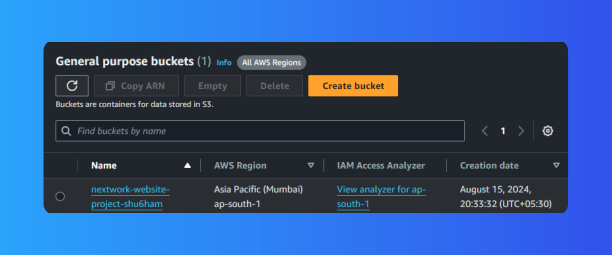
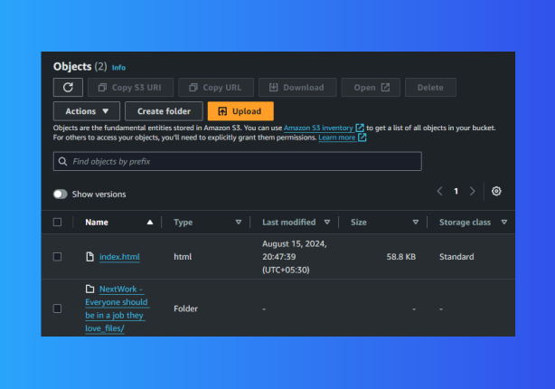
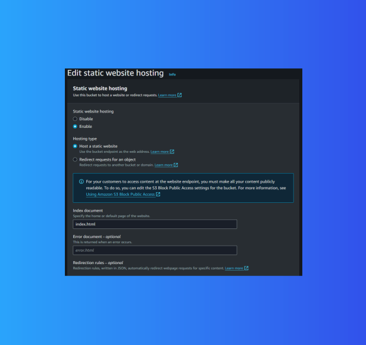

# AWS S3 Static Website Hosting Project

## Overview
This project demonstrates how to host a static website using Amazon S3. The website features the NextWork learning platform - a professional, responsive website with interactive elements, student testimonials, and modern design, fully hosted on S3.

 

## Features
- **Static Website Hosting**: Accessible via a public URL provided by S3
- **Professional Design**: NextWork learning platform with modern UI/UX
- **Interactive Elements**: Student testimonials, forms, and animations
- **Responsive Layout**: Works on desktop, tablet, and mobile devices
- **Custom Error Pages**: Configured custom error pages for better user experience
- **Access Management**: Implemented AWS S3 Bucket Policies and ACLs to control public access


## Local Development Setup

### Prerequisites
- Python 3.x installed on your system
- Web browser

### Running the Website Locally

1. **Navigate to the Website directory:**
   ```bash
   cd Website
   ```

2. **Start the local server:**
   
   **Option A - Using the provided scripts:**
   - Windows: Double-click `start_server.bat`
   - PowerShell: Run `start_server.ps1`
   
   **Option B - Manual command:**
   ```bash
   python -m http.server 8000
   ```

3. **Access the website:**
   Open your browser and go to: `http://localhost:8000`

### File Structure
```
Website/
├── index.html                                    # Main website file
├── NextWork - Everyone should be in a job they love_files/  # Assets folder
│   ├── *.css                                    # Stylesheets
│   ├── *.js                                     # JavaScript files
│   ├── *.jpg                                    # Student photos
│   ├── *.svg                                    # Graphics and icons
│   └── *.png                                    # Logo files
├── start_server.bat                             # Windows batch script
└── start_server.ps1                             # PowerShell script
```

## AWS S3 Deployment

### Step 1: Create an S3 Bucket
1. Log in to the [AWS Management Console](https://aws.amazon.com/).
2. Navigate to the `S3 service`.
3. Create a new bucket:
   * Give it a unique name (e.g., my-awesome-website-bucket).
   * Choose a region closest to your target audience (e.g., Asia Pacific (Mumbai) `ap-south-1`).
4. Enable ACLs:
   * During bucket creation, under "Object Ownership," select ACLs enabled.
   * This allows fine-grained control over the permissions of individual objects in the bucket.



### Step 2: Upload Website Files

1. **Upload your website files:**
   * Upload `index.html` to the root of your S3 bucket
   * Upload the entire `NextWork - Everyone should be in a job they love_files` folder
   * **Important:** Maintain the exact folder structure during upload
   * **Critical:** All images (1.jpg, 2.jpg, etc.) and assets must be uploaded for the website to display properly

2. **Required files to upload:**
   * `index.html` (main website file)
   * Complete `NextWork - Everyone should be in a job they love_files/` folder containing:
     - Student photos (1.jpg through 12.jpg)
     - CSS files (nextwork-staging.webflow.dc303a7da.min.css)
     - JavaScript files (webflow.js, jquery, etc.)
     - SVG graphics and icons
     - Company logos




### Step 3: Configure the Bucket for Static Website Hosting
1. Go to the bucket properties in the S3 console.
2. Enable static website hosting:
   * In the "Static website hosting" section, choose Enable.
   * Set index.html as the Index document.
   * Optionally, set a custom error document like error.html.




### Step 4: Make Files Public Using ACLs
1. **Select all uploaded files** in the S3 console (including all files in the assets folder)
2. From the **"Actions"** dropdown, choose **"Make public using ACL"**
3. **Confirm the action** - this grants public read access to all website files
4. **Verify:** All files should now show "Public" in the access column

### Step 5: Access Your Website
* Use the bucket's public URL to access the website. It typically looks like:
```
http://your-bucket-name.s3-website-region.amazonaws.com
```

 

## Troubleshooting

### Common Issues and Solutions

#### 1. Website Shows Broken Layout/Missing Styles
**Problem:** CSS and images not loading properly
**Solution:** 
- Ensure the `NextWork - Everyone should be in a job they love_files` folder is uploaded with exact name
- Verify all files in the assets folder are public via ACLs
- Check that folder structure matches exactly as shown above

#### 2. Images Not Displaying
**Problem:** Broken image icons or missing photos
**Solution:**
- Upload ALL image files (1.jpg through 12.jpg, SVG files, PNG logos)
- Ensure images are in the correct folder: `NextWork - Everyone should be in a job they love_files/`
- Make all image files public using ACLs

#### 3. 403 Forbidden Error
**Problem:** Cannot access website or specific files
**Solution:**
- Make sure all files are public using ACLs (not just bucket policy)
- Verify static website hosting is enabled
- Check that bucket allows public access

#### 4. Website Loads but Looks Plain/Unstyled
**Problem:** CSS files not loading
**Solution:**
- Verify `nextwork-staging.webflow.dc303a7da.min.css` is uploaded
- Ensure CSS file is in the assets folder and made public
- Check browser developer tools for 404 errors on CSS files 

## Using ACLs (Access Control Lists)

### Why Use ACLs?
ACLs allow you to grant specific read/write permissions to different AWS accounts or make content public. This provides more granular control compared to bucket policies alone.

### Implementation Steps:
1. **After uploading files:** Select all files in the S3 console
2. **Actions → Make public using ACL:** This grants public read access to website files
3. **Resolves 403 errors:** Ensures visitors can access your website content

**Important:** Both the HTML file AND all assets (images, CSS, JS) must be made public for the website to work properly.


### Troubleshooting Legacy Issues
* **403 Forbidden Error:** Ensure all objects in your bucket are made public using ACLs
* **Missing Images:** Upload all JPG, SVG, and PNG files from the assets folder
* **Broken Styling:** Verify CSS files are uploaded and accessible

## Cost Considerations
- **S3 Storage:** Minimal cost (typically under $1/month for small websites)
- **Data Transfer:** First 1GB outbound is free monthly
- **Requests:** GET requests are very affordable (few cents per thousand)

## Optional Enhancements
- **Custom Domain:** Use Route 53 to point your domain to the S3 website
- **HTTPS/SSL:** Implement CloudFront distribution for secure connections
- **CDN:** Use CloudFront for global content delivery and improved performance
- **Monitoring:** Set up CloudWatch for website analytics

## Project Architecture
The project uses Amazon S3 to host a static website with the following components:

* **S3 Bucket:** Stores all website files (HTML, CSS, JS, images)
* **Static Website Hosting:** Makes bucket content publicly accessible via web URL
* **ACLs (Access Control Lists):** Manages public access permissions for individual files
* **NextWork Platform:** Professional learning website with interactive features

## Technical Stack
- **Frontend:** HTML5, CSS3, JavaScript
- **Styling:** Webflow-generated CSS with custom animations
- **Images:** Optimized JPG photos and SVG graphics
- **Hosting:** Amazon S3 Static Website Hosting
- **Access Control:** S3 ACLs for public file access

---

## Additional Notes

This project demonstrates a complete static website deployment workflow on AWS S3. The NextWork learning platform showcases modern web development practices including responsive design, interactive elements, and optimized asset delivery.

**Local Development:** Use the provided server scripts for local testing before S3 deployment.

**Production Ready:** The website is optimized for production use with proper file organization and access controls.

I have documented all steps and troubleshooting solutions to ensure a comprehensive understanding of the S3 static hosting process.
